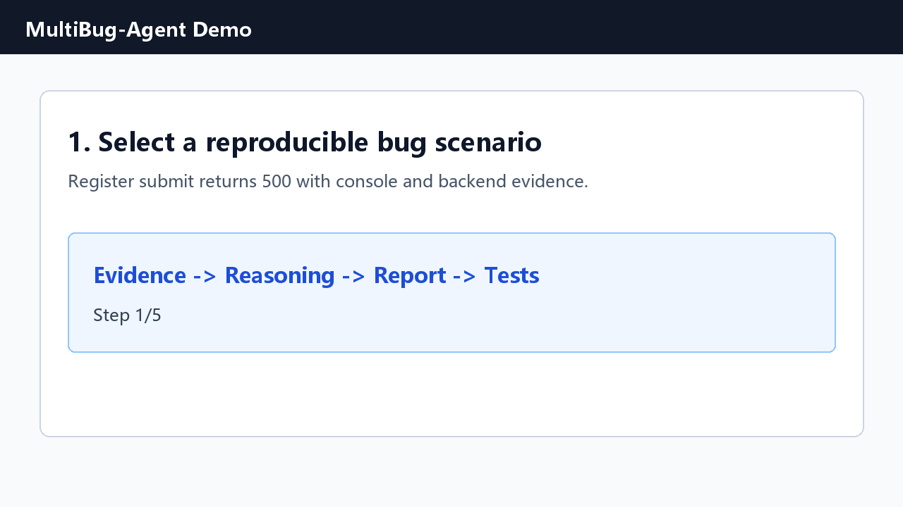
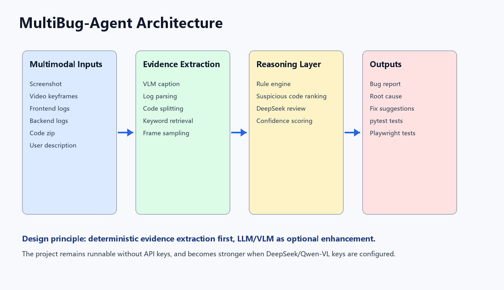
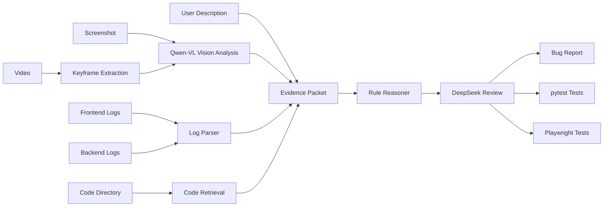

# MultiBug-Agent

Multimodal bug localization and automated test generation platform for Web applications.

MultiBug-Agent 将页面截图、操作录屏、前后端日志、代码片段和用户描述整合成一个缺陷分析证据包，结合规则解析、代码检索、可选 Qwen-VL 视觉分析和 DeepSeek 二次审查，自动生成 Bug 报告、复现步骤、可疑代码位置、修复建议以及 pytest / Playwright 测试用例。



## Why This Project

真实 Web 缺陷排查通常不是单一文本问题。一个 Bug 往往同时涉及：

- 页面截图中的异常状态
- 浏览器 Console 报错
- 后端接口日志
- 用户操作路径
- 前后端代码片段
- 复现步骤和回归测试

本项目的目标是把这些证据组织成一个可解释、可复现、可导出的测试开发工作流，而不是简单做一个聊天机器人外壳。

## Architecture





## Features

- Streamlit UI for interactive analysis.
- Built-in reproducible Web bug scenarios.
- Manual upload mode for screenshot, logs, code zip and operation recording.
- Frontend/backend log parsing and bug type classification.
- Suspicious code localization by keyword and error-category ranking.
- Optional Qwen-VL screenshot analysis for real visual understanding.
- Optional DeepSeek review for second-pass reasoning.
- Markdown Bug report export.
- pytest and Playwright test template generation.
- Evaluation script for bug type accuracy and suspicious file hit rate.
- GitHub Actions workflow for automated tests.

## Demo Cases

| Case | Scenario |
|---|---|
| `case_01_register_500` | Register submit returns 500 |
| `case_02_login_timeout` | Login loading state never releases |
| `case_03_upload_failed` | Image upload exceeds size limit |
| `case_04_blank_page_typeerror` | Profile page blank screen caused by null access |
| `case_05_order_amount_error` | Order total amount mismatch |
| `case_06_permission_403` | Normal user accesses admin page and receives 403 |

## Quick Start

### 1. Create virtual environment

```powershell
python -m venv .venv
```

If PowerShell blocks activation, you can directly use `.venv\Scripts\python.exe` as shown below.

### 2. Install dependencies

```powershell
.\.venv\Scripts\python.exe -m pip install -r requirements.txt
```

### 3. Run CLI demo

```powershell
.\.venv\Scripts\python.exe run_demo.py --case case_01_register_500
```

Enable optional DeepSeek review:

```powershell
.\.venv\Scripts\python.exe run_demo.py --case case_01_register_500 --use-llm
```

### 4. Run Streamlit UI

```powershell
.\.venv\Scripts\python.exe -m streamlit run app.py
```

Open:

```text
http://localhost:8501
```

## API Configuration

Copy the example environment file:

```powershell
copy .env.example .env
```

### DeepSeek Review

```text
LLM_PROVIDER=deepseek
DEEPSEEK_API_KEY=your_deepseek_key
LLM_API_BASE=https://api.deepseek.com
LLM_MODEL=deepseek-v4-flash
LLM_TIMEOUT_SECONDS=60
DEEPSEEK_THINKING=disabled
DEEPSEEK_REASONING_EFFORT=high
```

### Qwen-VL Vision Analysis

```text
VISION_PROVIDER=qwen
QWEN_API_KEY=your_dashscope_key
VISION_API_BASE=https://dashscope.aliyuncs.com/compatible-mode/v1
VISION_MODEL=qwen3-vl-plus
VISION_TIMEOUT_SECONDS=60
```

Notes:

- DeepSeek is used for text reasoning over structured evidence.
- Qwen-VL is used for visual analysis of UI screenshots.
- If API keys are not configured, the project falls back to local rule-based analysis.
- Do not commit `.env` to GitHub.

## Evaluation

Run:

```powershell
.\.venv\Scripts\python.exe eval\evaluate.py
```

Current built-in scenario results:

| Metric | Result |
|---|---:|
| Bug type accuracy | 6/6 = 100.0% |
| Top-1 suspicious file hit rate | 4/6 = 66.7% |
| Top-3 suspicious file hit rate | 6/6 = 100.0% |

The evaluation set is synthetic but reproducible. It is intended to verify pipeline behavior and provide a baseline for later real-world cases.

## Project Structure

```text
multibug-agent/
├── app.py
├── run_demo.py
├── requirements.txt
├── README.md
├── LICENSE
├── CHANGELOG.md
├── .env.example
├── .github/workflows/test.yml
├── assets/
│   ├── demo.gif
│   └── architecture.png
├── docs/
├── eval/
├── examples/
├── prompts/
├── src/
│   ├── bug_reasoner.py
│   ├── code_locator.py
│   ├── code_parser.py
│   ├── llm_client.py
│   ├── log_parser.py
│   ├── multimodal_context.py
│   ├── report_generator.py
│   ├── screenshot_analyzer.py
│   ├── test_generator.py
│   ├── video_analyzer.py
│   └── vision_analyzer.py
├── tests/
└── tools/
```

## What Is Actually Multimodal

This project supports multimodal evidence:

- Text: user description and report content.
- Image: UI screenshots.
- Video: operation recordings and extracted keyframes.
- Logs: frontend console logs and backend logs.
- Code: frontend/backend source snippets.
- Structured data: metadata, bug type, confidence score and test outputs.

With Qwen-VL configured, screenshots are analyzed by a vision-language model. With DeepSeek configured, the structured evidence packet is reviewed by an LLM.

## Roadmap

- Add Playwright trace collection for real browser reproduction.
- Add FAISS/Chroma hybrid code retrieval.
- Add more real-world bug scenarios.
- Add Docker deployment.
- Add Streamlit Cloud or Hugging Face Space demo.
- Add issue templates and contribution guide.

## Security Notes

Never commit:

- `.env`
- API keys
- real company logs
- private screenshots
- production source code
- large raw videos

Use `.env.example` for public configuration templates.

## License

MIT License.
