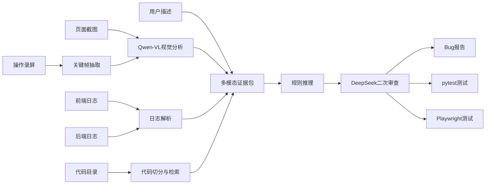

# 架构设计

## 模块职责

| 模块 | 职责 |
|---|---|
| `app.py` | Streamlit 页面入口 |
| `run_demo.py` | 命令行入口 |
| `src/log_parser.py` | 前后端日志解析 |
| `src/screenshot_analyzer.py` | 截图基础分析 |
| `src/vision_analyzer.py` | 可选 Qwen-VL 视觉分析 |
| `src/video_analyzer.py` | 录屏关键帧抽取 |
| `src/code_parser.py` | 代码扫描与切分 |
| `src/code_locator.py` | 可疑代码检索 |
| `src/bug_reasoner.py` | 缺陷分析编排 |
| `src/llm_client.py` | DeepSeek / OpenAI-compatible API |
| `src/report_generator.py` | Markdown 报告和测试文件生成 |
